# 💸 FinQuest

**FinQuest** is a **gamified personal finance tracker** that makes managing money fun, engaging, and habit-forming. It combines **gamification mechanics** with **AI-powered insights** to help users save, budget, and achieve financial goals while building healthy financial habits. 🏦🎯

---

## 🚀 Features

- 🎮 **Gamified Experience**: Turn budgeting and saving into a quest with streaks, rewards, and achievements.
- 💰 **Expense & Income Tracking**: Record your daily expenses and income.
- 🎯 **Goal Setting**: Set and track financial goals visually.
- 🤖 **AI Insights**: Smart suggestions on spending, saving, and budgeting.
- 📊 **Analytics Dashboard**: View trends and charts for your finances.
- 🔥 **Streak Tracking**: Maintain daily streaks for saving or budgeting habits.
- 📱 **Cross-Platform**: Works on web and mobile platforms.

---

## 🛠 Tech Stack

| Layer         | Technology                |
|---------------|--------------------------|
| 💻 Frontend   | React.js, Tailwind CSS, Vite |
| ⚡ Backend    | FastAPI                  |
| 🗄 Database   | MySQL                    |
| 🔐 Auth & Storage | Appwrite             |
| 🤖 AI Model   | OpenAI GPT-4             |
| 📱 Mobile     | Flutter        |

---

## 📸 Screenshots

*(Add your app screenshots here)*
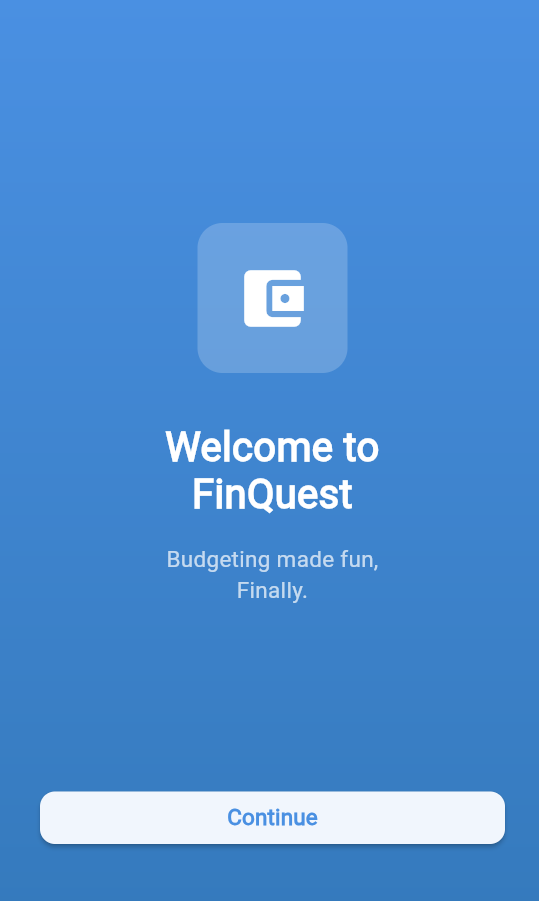  
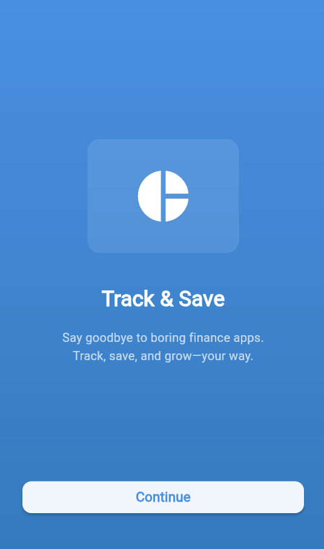  
  
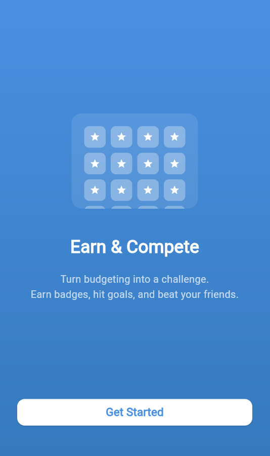  
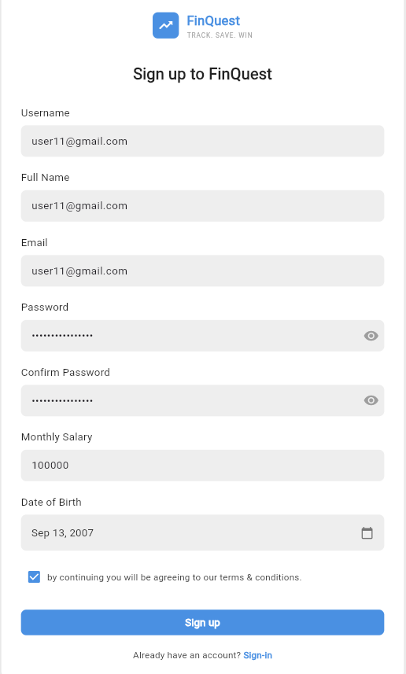  
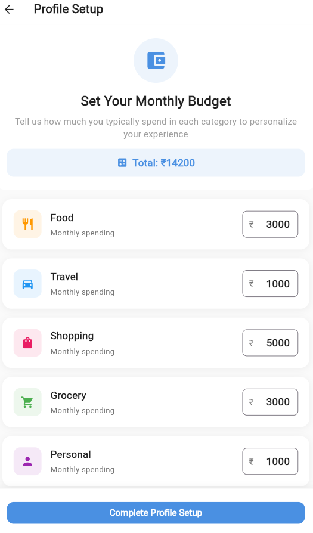
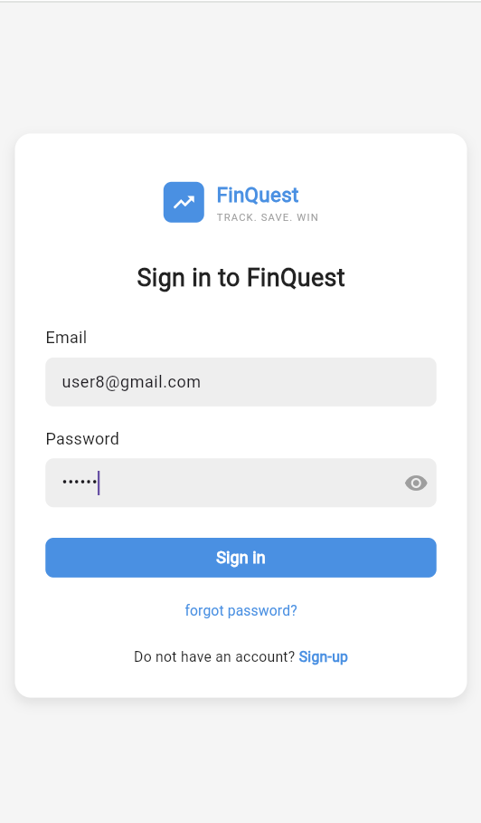    
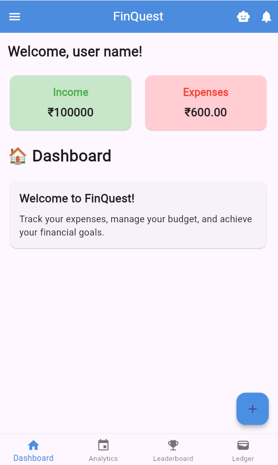  
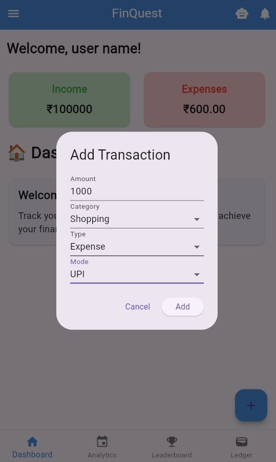  
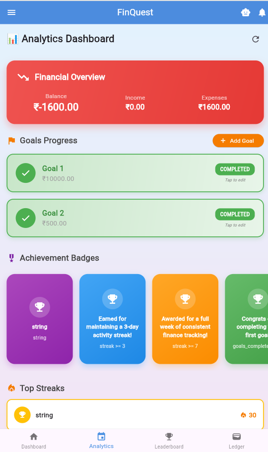  
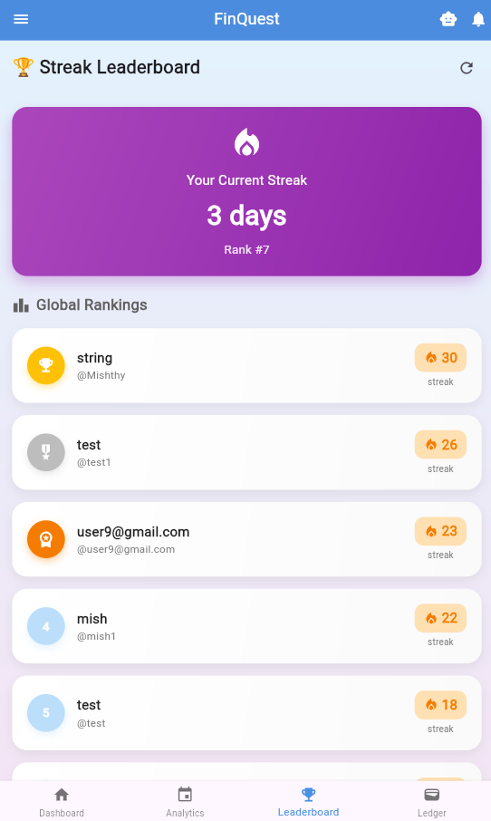  
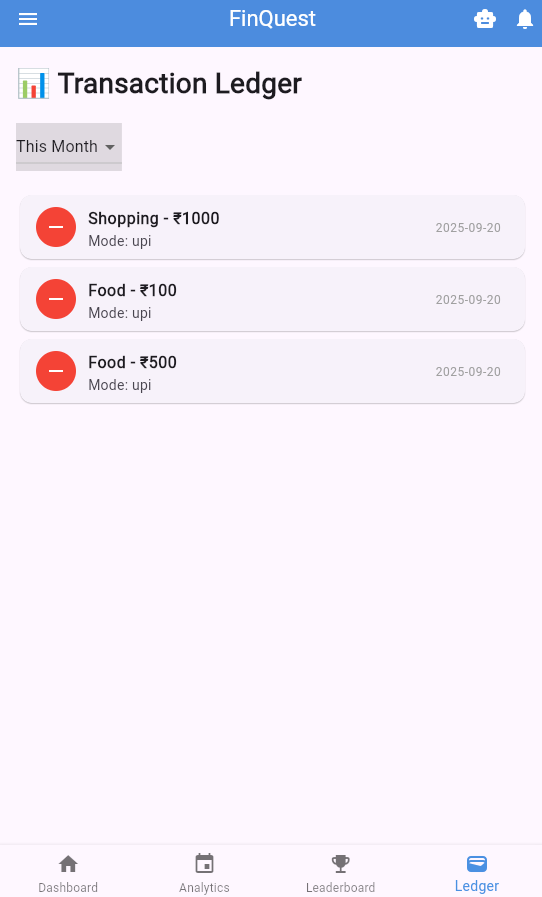  
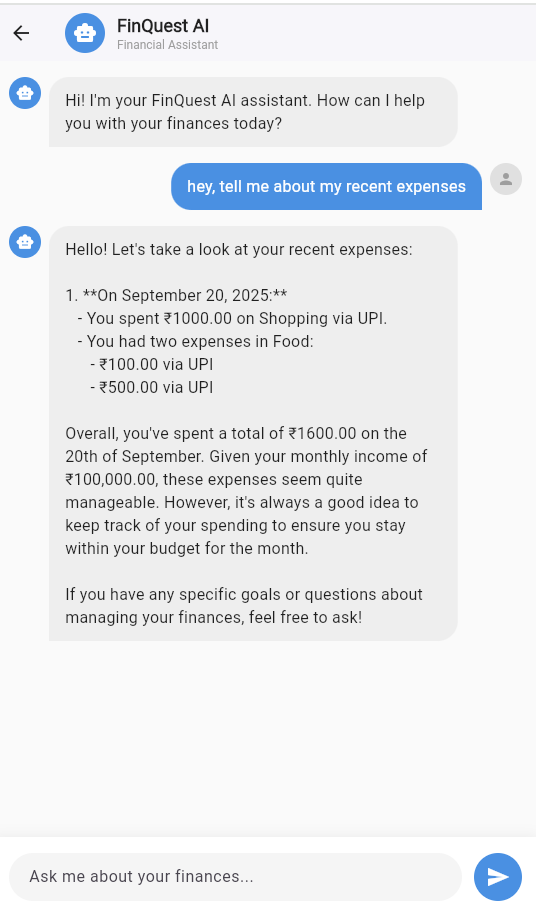  

---

